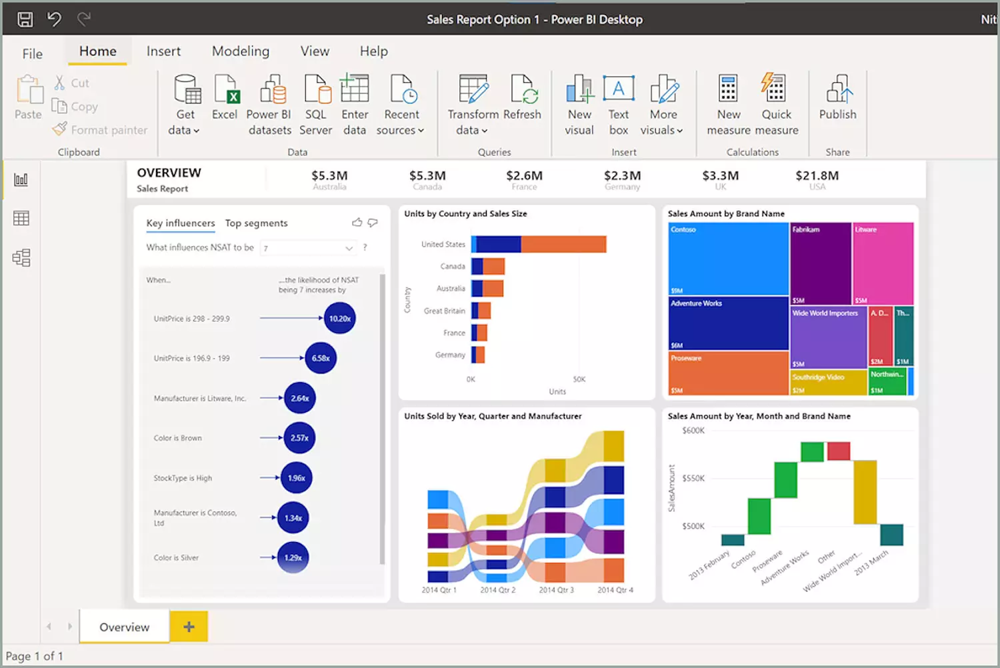

veille sur power BI : Power BI est un logiciel de traitement de données crée par microsoft  , il facilite la visualisation des données. Il peut etre utilisé dans énormément de domaine comme par exemple chez un comptable , dans le cadre du marketing , dans la gestion de stock ect... 

Dashboard : traduit par Tableau de bord , c'est la que sont rassemblés toutes les visualisations.

les Avantage d'un dashboard c'est qu'on peut avoir tout ses graphiques sous la main pour bien les analyser et qu'on puisse comparer ces graphiques néanmoins les désavantages de ce dashboard c'est qu'on peut vite etre submergé d'informations et ne pas pour pouvoir distinguer les info importantes de celle qui ne le sont pas .
Il y a plus ou moins une vingtaine de graphique différents  . Il y a par exemple le tableau , les différents type de graphique a bar , les graphiques par secteur , la matrices , la cartes  ect...

